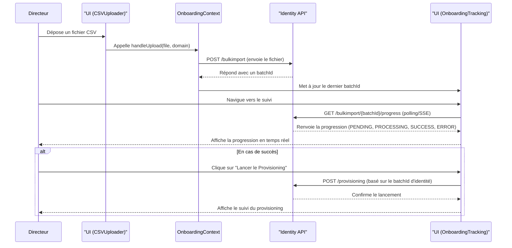

# Documentation Technique du Front-End EdConnekt

> Ce document est une documentation technique complète de l'application front-end EdConnekt (React/TypeScript). Il est généré et maintenu en se basant exclusivement sur l'analyse du code source pour garantir sa précision.

**Résumé**: Le projet est une application React moderne construite avec Vite, TypeScript et Tailwind CSS. Elle suit des principes d'architecture robustes, notamment une séparation claire des préoccupations grâce à l'utilisation de hooks personnalisés pour la logique métier et l'API Context de React pour l'état global. La communication avec le backend est modulaire, avec des services API dédiés pour chaque microservice, et la gestion de l'état serveur est assurée par `@tanstack/react-query`.

---

## Table des Matières

1.  [**Vue d’ensemble de l’architecture**](#a-vue-densemble-de-larchitecture)
    *   [Arborescence des répertoires](#arborescence-des-repertoires)
    *   [Principes d’architecture](#principes-darchitecture)
    *   [Système de styles](#systeme-de-styles)
    *   [Diagramme d'architecture](#diagramme-darchitecture)
2.  [**Démarrage et outillage**](#b-demarrage-et-outillage)
3.  [**Routage et navigation**](#c-routage-et-navigation)
4.  [**Services API et contrats**](#d-services-api-et-contrats)
    *   [Configuration du client HTTP](#configuration-du-client-http)
    *   [Intercepteurs et contexte](#intercepteurs-et-contexte)
    *   [Tableau récapitulatif des services API](#tableau-recapitulatif-des-services-api)
5.  [**Domaines fonctionnels clés**](#e-domaines-fonctionnels-cles)
    *   [Onboarding Directeur](#onboarding-directeur)
    *   [Supplies (Fournitures)](#supplies-fournitures)
    *   [Compétences (competence-service)](#competences-competence-service)
6.  [**États, données et gestion des erreurs**](#f-etats-donnees-et-gestion-des-erreurs)
7.  [**Conventions de code et bonnes pratiques**](#g-conventions-de-code-et-bonnes-pratiques)
8.  [**Localisation/i18n**](#h-localisationi18n)
9.  [**Sécurité et contexte**](#i-securite-et-contexte)
10. [**Roadmap et extensions**](#j-roadmap-et-extensions)
11. [**Comment contribuer**](#comment-contribuer)
12. [**Pièges fréquents**](#pieges-frequents)

---

## A. Vue d’ensemble de l’architecture

### Arborescence des répertoires

L'organisation du code dans `react-frontend/src/` suit une approche par type de fonctionnalité, ce qui facilite la localisation du code.

-   `src/api/`: **Cœur de la communication Backend.** Contient les clients API générés (via OpenAPI) pour chaque microservice (ex: `supplies-service`, `competence-service`). Chaque sous-dossier contient la configuration de l'instance Axios (`http.ts`), les types de données (DTOs) et les endpoints.
-   `src/assets/`: Fichiers statiques comme les images et les polices.
-   `src/components/`: **Composants React réutilisables.** Ils sont organisés en sous-dossiers correspondant aux domaines fonctionnels ou aux pages (ex: `components/directeur/onboarding`, `components/supplies`). Le dossier `components/ui/` contient des composants d'interface génériques (boutons, inputs, etc.).
-   `src/contexts/`: **Gestion de l'état global client.** Contient tous les providers de contexte React (ex: `IdentityContextProvider.tsx`, `OnboardingContext.tsx`).
-   `src/hooks/`: **Logique métier et accès aux données.** Contient tous les hooks personnalisés, qui encapsulent les appels API (via TanStack Query) et la logique métier complexe. C'est le cerveau de l'application.
-   `src/layouts/`: Composants de mise en page principaux, comme `DashboardLayout.tsx` qui structure l'interface post-connexion.
-   `src/pages/`: **Composants de haut niveau représentant les pages de l'application.** Chaque fichier correspond à une route (ex: `pages/supplies/TeacherSuppliesPage.tsx`). Ils assemblent les composants et les hooks pour construire une vue.
-   `src/services/`: Contient des services de plus haut niveau ou transverses qui ne sont pas des clients API directs (ex: `websocketService.ts`).
-   `src/styles/`: Fichiers de style globaux (ex: `index.css`).
-   `src/utils/`: Fonctions utilitaires pures et partagées dans l'application.

### Principes d’architecture

1.  **Découpage par Feature**: L'architecture est fortement orientée "feature". Chaque fonctionnalité majeure (Onboarding, Supplies, Compétences) possède ses propres composants, hooks, contextes et pages.
2.  **Hooks personnalisés pour la logique**: Toute la logique d'accès aux données et une grande partie de la logique métier sont extraites dans des hooks personnalisés (`src/hooks/`). Cela allège considérablement les composants de page et les rend plus déclaratifs.
3.  **Gestion d'état découplée**:
    *   **État Serveur**: Géré exclusivement par **`@tanstack/react-query`**. Les hooks personnalisés encapsulent `useQuery` et `useMutation` pour la mise en cache, le re-fetching et la gestion des états (loading, error).
    *   **État Client**: Géré par l'**API Context de React** pour les données globales qui ne viennent pas du serveur (ex: thème UI, identité de l'utilisateur, filtres actifs).
4.  **Container/Presentational Pattern (implicite)**: Les composants de page (`src/pages/`) agissent comme des "containers" qui récupèrent les données via les hooks et les passent à des composants de présentation plus simples (`src/components/`).

### Système de styles

Le style est géré par **Tailwind CSS**, avec une configuration avancée pour assurer la cohérence et la maintenabilité.

-   **Fichier de configuration**: `react-frontend/tailwind.config.js`.
-   **Theming**: Un système de theming pour les modes clair/sombre est implémenté dans `src/theme.tsx`. Il utilise un Contexte React (`ColorModeContext`) et une fonction `tokens` qui mappe les modes à des classes utilitaires Tailwind.
-   **Variables CSS**: Le projet utilise des variables CSS (`var(--primary)`, `var(--background)`) dans `tailwind.config.js`. Cela permet de changer de thème de manière très efficace en modifiant simplement les valeurs de ces variables dans un fichier CSS global (probablement `src/index.css`), une excellente pratique pour le theming dynamique.
-   **Convention**: Le style est appliqué directement dans les composants via les classes utilitaires Tailwind, favorisant la colocalisation du balisage et du style.

### Diagramme d'architecture

Ce diagramme illustre le flux de données général dans l'application.

```mermaid
graph TD
    subgraph Browser
        U[Utilisateur] --> C[Composant React];
    end

    subgraph "React App (Client-Side)"
        C -- "Appelle hook" --> H[Hook Personnalisé (`useRessource`)];
        H -- "Utilise Contexte" --> CTX[Context API (`IdentityContext`)];
        CTX -- "Fournit Etab/Role" --> I[Intercepteur Axios];
        H -- "Déclenche requête" --> TQ[@tanstack/react-query];
        TQ -- "Gère cache & états" --> H;
        TQ -- "Exécute" --> I;
        I -- "Injecte Headers (X-Etab, X-Roles, Auth)" --> HTTP;
        HTTP[Client Axios] -- "Requête HTTP" --> API;
    end

    subgraph Backend
        API[Microservice API];
    end

    API -- "Réponse HTTP" --> HTTP;
    HTTP -- "Réponse" --> I;
    I -- "Réponse" --> TQ;
    TQ -- "Met à jour données" --> H;
    H -- "Retourne données" --> C;
    C -- "Met à jour UI" --> U;

    style C fill:#a7f3d0
    style H fill:#bae6fd
    style CTX fill:#e9d5ff
    style TQ fill:#fde68a
```

## B. Démarrage et outillage

-   **Pré-requis**: Node.js, et un gestionnaire de paquets comme `npm` ou `pnpm` (le projet utilise `package-lock.json`, donc `npm` est le standard). Les variables d'environnement sont requises pour les URLs des API (ex: `VITE_SUPPLIES_API_BASE_URL`).
-   **Scripts NPM** (`package.json`):
    -   `npm run dev`: Lance le serveur de développement Vite sur le port 8000.
    -   `npm run build`: Compile le projet TypeScript et construit l'application pour la production.
    -   `npm run lint`: Lance ESLint pour analyser le code et trouver des erreurs potentielles.
    -   `npm run lint:strict`: Lance ESLint avec des règles plus strictes (0 avertissement maximum).
-   **Gestion des environnements**: Le projet utilise Vite, qui gère nativement les variables d'environnement via des fichiers `.env` (ex: `.env.development`, `.env.production`).

## C. Routage et navigation

Le routage est géré par `react-router-dom` v6 dans le fichier `react-frontend/src/App.tsx`.

-   **Routes principales**: Les routes sont définies dans un objet central `routesByRole` qui mappe un rôle utilisateur à une liste de routes autorisées.
-   **Gardes de Route (Protection)**: L'accès aux pages est protégé par un système à deux niveaux dans le composant `AppContent`:
    1.  **Garde d'Authentification**: Le hook `useAuth()` vérifie si l'utilisateur est authentifié via Keycloak. Si non, il est redirigé vers `/login`.
    2.  **Garde de Contexte**: Si l'utilisateur est authentifié mais n'a pas encore sélectionné son contexte (établissement et rôle), le hook `useIdentityContext()` le redirige vers la page `/select-contexte`. C'est une étape cruciale pour le fonctionnement de l'application multi-tenant.
-   **Navigation**: La navigation entre les sections est basée sur les rôles. Le `DashboardLayout` affiche probablement une barre de navigation différente en fonction du rôle de l'utilisateur connecté.

## D. Services API et contrats

### Configuration du client HTTP

Chaque microservice backend a son propre client API dans `src/api/`. Par exemple, le service des fournitures est dans `src/api/supplies-service/`.

Dans chaque dossier de service, le fichier `http.ts` est central. Il crée et configure une instance **Axios** dédiée pour ce service. La `baseURL` de l'API est configurable via une variable d'environnement (ex: `VITE_SUPPLIES_API_BASE_URL`).

### Intercepteurs et contexte

Deux intercepteurs Axios sont cruciaux pour le fonctionnement de l'application :

1.  **Intercepteur de Requête (dans chaque `http.ts`)**:
    -   Avant chaque requête, il récupère le contexte actif (établissement et rôle) via `getActiveContext()`.
    -   Il injecte ensuite dynamiquement les en-têtes `X-Etab` et `X-Roles`. **Ceci confirme le refactoring clé remplaçant `X-Etab-Select` et `X-Roles-Select`**.
    -   Il attache également le token d'authentification `Bearer`.

    ```typescript
    // Extrait de src/api/supplies-service/http.ts
    suppliesAxios.interceptors.request.use((config) => {
      // ...
      const { etabId: activeEtabId, role: activeRole } = getActiveContext();
      if (activeEtabId) {
        (config.headers as Record<string, string>)['X-Etab'] = activeEtabId;
      }
      if (activeRole) {
        (config.headers as Record<string, string>)['X-Roles'] = activeRole;
      }
      return config;
    });
    ```

2.  **Intercepteur de Réponse (centralisé)**:
    -   Le fichier `src/api/httpAuth.ts` contient une fonction `attachAuthRefresh`.
    -   Cette fonction attache un intercepteur qui gère le renouvellement de token. Si une API retourne une erreur `401 Unauthorized`, il tente de rafraîchir le token via Keycloak et de rejouer la requête automatiquement.

### Tableau récapitulatif des services API

| Service                       | Chemin du client                            | Contexte                               |
| ----------------------------- | ------------------------------------------- | -------------------------------------- |
| **Admission Service**         | `src/api/admission-service/`                | `X-Etab`, `X-Roles`                    |
| **Classe Service**            | `src/api/classe-service/`                   | `X-Etab`, `X-Roles`                    |
| **Competence Service**        | `src/api/competence-service/`               | `X-Etab`, `X-Roles`                    |
| **Establishment Service**     | `src/api/establishment-service/`            | `X-Etab`, `X-Roles`                    |
| **Identity Service**          | `src/api/identity-service/`                 | `X-Etab`, `X-Roles` (pour l'onboarding) |
| **Resource Service**          | `src/api/resource-service/`                 | `X-Etab`, `X-Roles`                    |
| **Supplies Service**          | `src/api/supplies-service/`                 | `X-Etab`, `X-Roles`                    |
| ... (autres services)         | ...                                         | ...                                    |

## E. Domaines fonctionnels clés

### Onboarding Directeur

Le flux d'onboarding permet aux directeurs d'importer des utilisateurs en masse via des fichiers CSV. La logique est principalement contenue dans les composants sous `src/components/directeur/onboarding/` et pilotée par le `OnboardingContext`.

-   **Composants clés**:
    -   `CSVUploader.tsx`: Interface pour téléverser les fichiers CSV pour chaque type d'utilisateur (élèves, parents, etc.).
    -   `OnboardingTracking.tsx`: Tableau de bord pour suivre la progression des imports (phase d'identité) et du provisioning (création des comptes).
    -   `ProgressStats.tsx` / `ErrorsTable.tsx`: Composants pour afficher les statistiques de progression et les erreurs de validation détaillées.
    -   `EstablishmentSelector.tsx`: **Ce composant est bien présent dans `CSVUploader.tsx`** pour permettre au directeur de choisir l'établissement cible de l'import.

-   **Workflow et décisions techniques**:
    1.  **Upload**: Le directeur dépose un fichier dans `CSVUploader`.
    2.  **Validation (côté serveur)**: Le code front-end de validation CSV existe mais est désactivé. La validation est maintenant entièrement déléguée à l'API pour plus de robustesse.
    3.  **Suivi**: `OnboardingTracking.tsx` affiche les "lots" d'import. Il utilise une combinaison de polling et de **Server-Sent Events (SSE)** pour un suivi en temps réel.
    4.  **Provisioning**: Une fois qu'un lot est validé, le directeur peut lancer manuellement le "provisioning", qui crée les comptes dans Keycloak.



### Supplies (Fournitures)

-   **Page Enseignant (`src/pages/supplies/TeacherSuppliesPage.tsx`)**:
    -   Permet aux enseignants de gérer la liste de fournitures pour une classe et une campagne données.
    -   Utilise le hook `useSuppliesTeacherList(campaignId, classId)` pour récupérer les données. Le **filtrage par `classId` est fait côté serveur**, ce qui est performant.
    -   Le hook `useFilters()` et le `FilterContext` sont utilisés pour **mémoriser la dernière classe sélectionnée par l'enseignant**, améliorant l'UX.
    -   Les suggestions d'articles ne sont pas visibles directement dans ce fichier, mais la logique d'ajout est simple.

-   **Page Directeur (`src/pages/directeur/SuppliesCampaignsPage.tsx`)**:
    -   Permet de créer et gérer les campagnes de fournitures.
    -   Le hook `useCreateCampaign` est utilisé pour la création. Le payload envoyé à l'API inclut bien un champ `classes?: Array<string>`, ce qui est conforme aux exigences de l'API.

### Compétences (competence-service)

Ce module, très complet, est géré principalement par `src/pages/referentiels/ReferentielsManager.tsx`.

-   **Intégration complète de l'API**:
    -   `usePublicReferentialTree`: Implémente la récupération de l'arborescence complète d'un référentiel.
    -   `useLookupCompetencyByCode`: Implémente la fonctionnalité de recherche par code exact.
    -   `useCompetency`, `useSubject`, `useAssignment`: Implémentent les appels `GET by id` pour les pages de détail (`CompetencyDetailPage.tsx`, etc.).
-   **Fonctionnalités avancées**:
    -   Un onglet "Catalogue Global" permet de visualiser et de cloner des référentiels globaux.
    -   Un onglet "Événements" permet de suivre les événements de domaine (pattern Outbox) et de les rejouer si nécessaire, un outil de diagnostic puissant.
-   **UI et UX**: L'interface est riche et organisée en onglets, avec des filtres, de la pagination, et une navigation contextuelle (un double-clic sur un référentiel navigue vers les domaines, etc.).

## F. États, données et gestion des erreurs

-   **Store**: Pas de store externe comme Redux/Zustand. L'état global est géré par l'**API Context** de React. Chaque contexte est dédié à un domaine (`OnboardingContext`, `FilterContext`, `IdentityContextProvider`). `IdentityContextProvider` est le plus critique, car il fournit le contexte de l'utilisateur (établissement, rôle) à toute l'application.
-   **Hooks personnalisés**: C'est la stratégie centrale pour la gestion des données.
    -   **Nommage**: `use[Ressource]` pour la lecture (ex: `useClasses`), `use[Action][Ressource]` pour l'écriture (ex: `useCreateClasse`).
    -   **Responsabilité**: Chaque hook encapsule l'appel API, la logique de `@tanstack/react-query`, la gestion des clés de cache et les invalidations.
-   **Gestion des erreurs**:
    -   Les hooks `useQuery` retournent un état `isError` et un objet `error`, qui sont utilisés dans les composants pour afficher des messages d'erreur.
    -   Des composants comme `ErrorsTable.tsx` sont utilisés pour afficher des listes d'erreurs de validation de manière structurée.
    -   Les notifications `toast` (`react-hot-toast`) sont utilisées pour le feedback utilisateur immédiat après une action.

## G. Conventions de code et bonnes pratiques

-   **Nommage**:
    -   Fichiers/Composants: `PascalCase.tsx` (ex: `TeacherSuppliesPage.tsx`).
    -   Hooks: `useCamelCase.ts` (ex: `useSuppliesTeacherList.ts`).
-   **Typage**: Le projet utilise TypeScript de manière extensive. Les types API sont générés et importés depuis les dossiers `src/api/*/`.
-   **Styleguide UI**: Le projet utilise une combinaison de composants UI personnalisés (`src/components/ui/`) et de composants headless de `@radix-ui`, stylisés avec Tailwind CSS. La cohérence est assurée par la configuration dans `tailwind.config.js` et les tokens dans `src/theme.tsx`.

## H. Localisation/i18n

-   **Bibliothèque**: `i18next` avec `react-i18next`.
-   **Configuration**: `src/i18n.ts`. Les traductions sont chargées dynamiquement depuis le serveur grâce à `i18next-http-backend`.
-   **Organisation des fichiers**: Les traductions se trouvent dans `public/locales/`. Chaque langue a un dossier (ex: `fr`, `en`) contenant un `translation.json`.
-   **Comment ajouter/modifier des traductions**:
    1.  **Ajouter une clé**: Ajoutez la même clé dans `public/locales/fr/translation.json` et `public/locales/en/translation.json`.
    2.  **Ajouter une langue**: Créez un nouveau dossier (ex: `public/locales/es/`) et copiez-y un `translation.json` traduit. `i18next` la détectera automatiquement.

## I. Sécurité et contexte

-   **Gestion des en-têtes**: Les en-têtes `X-Etab` et `X-Roles`, cruciaux pour l'architecture multi-tenant, sont injectés dans chaque requête API par un intercepteur Axios situé dans les fichiers `src/api/*/http.ts`.
-   **Propagation du contexte**: Le contexte est initialement défini lors de la connexion ou via la page de sélection de contexte (`/select-contexte`). Il est stocké et géré par le `IdentityContextProvider` (`src/contexts/IdentityContextProvider.tsx`) et mis à disposition du reste de l'application.
-   **Accès conditionnel**: Le contrôle d'accès est géré à plusieurs niveaux :
    -   **Niveau Route**: L'objet `routesByRole` dans `App.tsx` n'affiche que les routes autorisées pour le rôle de l'utilisateur.
    -   **Niveau Composant**: Les composants peuvent conditionner l'affichage de certains éléments en fonction du rôle de l'utilisateur (ex: un bouton "Admin seulement").

## J. Roadmap et extensions

-   **Points d'extension**: L'architecture modulaire facilite l'ajout de nouvelles fonctionnalités. Pour ajouter une nouvelle page :
    1.  Créer le composant de page dans `src/pages/`.
    2.  Créer les hooks nécessaires dans `src/hooks/` pour interagir avec l'API.
    3.  Créer les composants de présentation dans `src/components/`.
    4.  Ajouter la nouvelle route à l'objet `routesByRole` dans `src/App.tsx`.
-   **Tech Debt / TODOs repérés**:
    -   `src/components/directeur/onboarding/CSVUploader.tsx`: Contient du code de validation CSV côté client qui est commenté et non utilisé. Il pourrait être nettoyé pour éviter toute confusion, car la validation est maintenant déléguée au serveur.

---

## Comment contribuer

1.  **Logique métier**: La logique complexe doit être placée dans un hook personnalisé dans `src/hooks/`, pas directement dans un composant.
2.  **État global**: Si un état doit être partagé entre plusieurs composants non liés, créez un nouveau Contexte dans `src/contexts/`. N'abusez pas du contexte pour des états locaux.
3.  **Composants UI**: Si un composant d'interface est réutilisable, placez-le dans `src/components/ui/`.
4.  **Traductions**: N'oubliez pas d'ajouter les clés de traduction dans les deux langues (`fr` et `en`) pour tout texte visible par l'utilisateur.
5.  **En-têtes de contexte**: Vous n'avez pas besoin de gérer manuellement les en-têtes `X-Etab` et `X-Roles`. L'intercepteur Axios s'en charge automatiquement pour toutes les requêtes.

## Pièges fréquents

-   **Oublier le contexte**: De nombreuses fonctionnalités dépendent du contexte actif (`etabId`, `role`). Si une page ne fonctionne pas comme prévu, vérifiez d'abord que le `IdentityContext` est correctement initialisé et fournit les bonnes valeurs.
-   **Modifier directement les DTOs générés**: Les fichiers dans `src/api/*/` sont générés. Ne les modifiez pas manuellement. Si un type ou un endpoint doit changer, il faut mettre à jour la spécification OpenAPI et régénérer les clients.
-   **Valider côté client**: Comme vu dans l'Onboarding, la tendance est de déléguer la validation métier complexe à l'API. Évitez de dupliquer cette logique côté front, sauf pour des validations de format simples (ex: email).