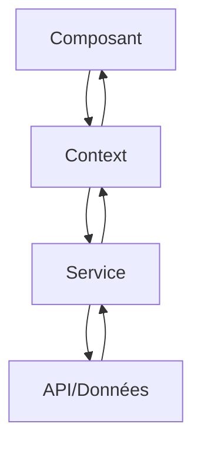
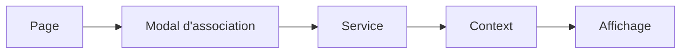

# Architecture EdConnekt

## Vue d'ensemble

EdConnekt est une application web React moderne construite avec TypeScript, conçue pour la gestion éducative. L'architecture suit les principes de développement moderne avec une séparation claire des responsabilités.

## 🏗️ Architecture générale

### Stack technologique

- **Frontend** : React 18 + TypeScript
- **Styling** : Tailwind CSS
- **État global** : Context API + Hooks personnalisés
- **Routing** : React Router v6
- **Build** : Vite
- **Linting** : ESLint
- **Formatage** : Prettier

### Structure des dossiers

```
src/
├── components/          # Composants réutilisables
│   ├── ui/            # Composants UI de base
│   ├── course/        # Composants spécifiques aux cours
│   ├── eleve/         # Composants spécifiques aux élèves
│   └── ...
├── pages/             # Pages de l'application
├── contexts/          # Contextes React (état global)
├── hooks/             # Hooks personnalisés
├── services/          # Services API et logique métier
├── lib/               # Utilitaires et données mock
├── assets/            # Ressources statiques
└── config/            # Configuration
```

## 🧩 Composants principaux

### 1. Système de composants

#### Composants UI de base (`src/components/ui/`)
- Composants réutilisables (Button, Dialog, Modal, etc.)
- Design system cohérent
- Accessibilité intégrée

#### Composants métier
- **Course** : Gestion des cours et leçons
- **Eleve** : Gestion des élèves et évaluations
- **Evaluation** : Système d'évaluation et notes
- **Resource** : Gestion des ressources pédagogiques
- **Remediation** : Système de remédiation

### 2. Système de contexte

#### Contextes principaux
- **ResourceContext** : Gestion globale des ressources
- **FilterContext** : Filtres et recherche
- **NotificationContext** : Notifications système
- **StudentContext** : Données des élèves

### 3. Services

#### Services API
- **courseResourceService** : Gestion des ressources de cours
- **remediationResourceService** : Gestion des ressources de remédiation
- **resourceService** : Service général des ressources

## 🔄 Flux de données

### 1. Gestion d'état



### 2. Flux des ressources



## 🎨 Design System

### Couleurs principales
- **Orange** : Couleur principale (#f97316)
- **Slate** : Texte et éléments neutres
- **Green** : Succès et validation
- **Red** : Erreurs et alertes

### Composants de base
- **ActionCard** : Cartes d'action
- **Dialog** : Modales et popups
- **Button** : Boutons avec variantes
- **Badge** : Badges et étiquettes

## 🔐 Authentification et autorisation

### Système d'authentification
- **Keycloak** : SSO et gestion des utilisateurs
- **Rôles** : Enseignant, Élève, Parent, Admin
- **Permissions** : Gestion fine des accès

### Rôles utilisateurs
- **Enseignant** : Gestion des cours, évaluations, remédiations
- **Élève** : Consultation des cours, notes, ressources
- **Parent** : Suivi des enfants
- **Admin** : Administration complète

## 📱 Responsive Design

### Breakpoints
- **Mobile** : < 768px
- **Tablet** : 768px - 1024px
- **Desktop** : > 1024px

### Stratégie mobile-first
- Design adaptatif
- Navigation optimisée
- Interactions tactiles

## 🚀 Performance

### Optimisations
- **Code splitting** : Chargement à la demande
- **Lazy loading** : Composants et images
- **Memoization** : React.memo et useMemo
- **Bundle optimization** : Vite pour le build

### Métriques
- **First Contentful Paint** : < 1.5s
- **Largest Contentful Paint** : < 2.5s
- **Cumulative Layout Shift** : < 0.1

## 🔧 Configuration

### Environnements
- **Development** : Hot reload, debugging
- **Staging** : Tests et validation
- **Production** : Optimisé et sécurisé

### Variables d'environnement
```env
VITE_API_URL=...
VITE_KEYCLOAK_URL=...
VITE_APP_NAME=EdConnekt
```

## 🧪 Tests

### Stratégie de test
- **Unit tests** : Composants et services
- **Integration tests** : Flux utilisateur
- **E2E tests** : Scénarios complets

### Outils
- **Jest** : Framework de test
- **React Testing Library** : Tests de composants
- **Cypress** : Tests E2E

## 📦 Déploiement

### Pipeline CI/CD
1. **Build** : Compilation et optimisation
2. **Tests** : Exécution des tests
3. **Lint** : Vérification du code
4. **Deploy** : Déploiement automatique

### Infrastructure
- **Frontend** : Serveur web statique
- **CDN** : Distribution globale
- **Monitoring** : Surveillance des performances

## 🔄 Évolutions futures

### Court terme
- [ ] Système de notifications push
- [ ] Mode hors ligne
- [ ] Analytics avancés

### Moyen terme
- [ ] PWA complète
- [ ] API GraphQL
- [ ] Micro-frontends

### Long terme
- [ ] IA pour recommandations
- [ ] Réalité augmentée
- [ ] Blockchain pour certifications

## 📚 Documentation associée

- [REMEDIATION_RESOURCES.md](./REMEDIATION_RESOURCES.md) - Intégration des ressources
- [API_DOCUMENTATION.md](./API_DOCUMENTATION.md) - Documentation des APIs
- [DEPLOYMENT.md](./DEPLOYMENT.md) - Guide de déploiement

---

*Architecture mise à jour le : [Date]*
*Version : [Version du projet]* 